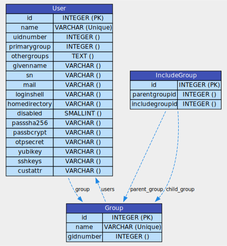

# GLAuth Utility Kubernetes Charmed Operator

[](https://charmhub.io/glauth-utils)

[](https://github.com/juju/juju)

[](https://github.com/canonical/glauth-k8s-operator/blob/main/LICENSE)

[](https://github.com/canonical/glauth-utils/actions?query=branch%3Amain)
[](https://github.com/pre-commit/pre-commit)

This repository holds a utility Kubernetes charmed operator
for [GLAuth Kubernetes Charmed Operator](https://github.
com/canonical/glauth-k8s-operator).

It aims to supplement the `glauth-k8s` charmed operator by the following:

- Use the [LDIF](https://en.wikipedia.org/wiki/LDAP_Data_Interchange_Format) to
  apply data changes into the LDAP directory

## Usage

The `glauth-utils` charmed operator can be deployed using the following command:

```shell
$ juju deploy glauth-utils --channel edge --trust
```

## Integrations

The `glauth-utils` charmed operator requires a Juju integration with the
`glauth-k8s` charmed operator by using the `auxiliary` Juju interface:

```shell
$ juju integrate glauth-utils:auxiliary glauth-k8s:auxiliary
```

The following diagram illustrates the overall deployment architecture:


## Actions

The `glauth-utils` charmed operator offers the following Juju actions.

### `apply-ldif`

The `apply-ldif` action helps load an LDIF file to apply any defined data
changes into the `glauth-k8s` charmed operator's backend datastore (e.g.
PostgreSQL database).

```shell
# 1. Transfer the LDIF file to the remote charm container in the leader unit
$ juju scp -m <model> <path-to-ldif-file> <leader-unit>:<path-to-ldif-file-in-remote-container>

# 2. Apply the LDIF file
$ juju run <leader-unit> apply-ldif path=<path-to-ldif-file-in-remote-container>
```

> 📚 Please refer to the [LDIF samples](SAMPLES.md) to see what directory update
> requests are supported in the charmed operator.

## More Information

The following diagram shows the database schema used by the `glauth-k8s`
charmed operator's backend datastore.



> ⚠️ **NOTE**
>
> The backend relational database schema is determined by a GLAuth's database
> plugin (e.g. the[ glauth-postgres](https://github.com/glauth/glauth-postgres)
> plugin).

## Contributing

Please refer to the [Contributing](CONTRIBUTING.md) for developer guidance.
Please see the [Juju SDK documentation](https://juju.is/docs/sdk) for more
information about developing and improving charms.

## Licence

The GLAuth Kubernetes Charmed Operator is free software, distributed under the
Apache Software License, version 2.0.
See [LICENSE](LICENSE) for more information.
